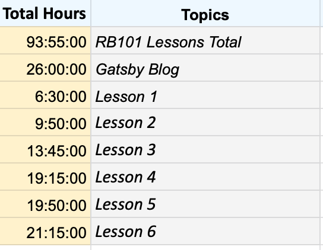
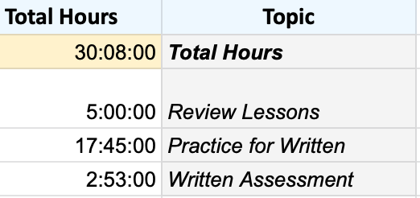

I recently finished Launch School's RB101 Programming Foundations course and finally reached the intimidating RB109 Assessment portion. I wanted to share a breakdown of my timeline and how I prepared for the Written Assessment. I still have yet to tackle the Interview portion, but I know for myself that I will need much more time to practice problem solving.

There is a lot of information to digest in the first course. Not only are you learning syntax of the Ruby language but you are also figuring out how to problem solve. The amount of time it takes to get through the material is different for everyone. As you will see in my breakdown there were some lessons I spent half my time on while others I breezed through quickly. It's difficult not to compare yourself to others, which I was guilty and still am, but it's important to remind yourself that this is about your journey, so do what works for you. Most importantly enjoy the process!

## RB101 Lessons

I am a visual learner so as I go through the lessons I took notes in a **Markdown** file. I previously used [Notion](https://www.notion.so) but I felt it was too clunky for me. So I switched over to using [Typora](https://typora.io). I highly recommend! There are themes you can choose from and you can even design your own. Very customizable and fast.

Since I also wanted a backup of my notes, I created a local git repository and pushed my notes to [Github](https://github.com/marykasp/ls-notes).

At the same time I also worked through Ruby basic problems when I needed a break from the lessons. I had some problems I found throughout the internet and of course worked through LS's Small Problems set. I tried using [Anki](https://www.notion.so) notecards but realized I was wasting a lot of time trying to stylize the cards to make them more enjoyable to use. So I gave up on that. Notecards have never really worked for me personally in the past but the **Anki** software is great for spaced repitition.

### Timeline

Overall I spent ~**93** hours in RB101 - lessons, videos, large projects, and about half of the small problems


I didn't track how long I spent on problems or reviewing topics. I just tracked the amount of time total I spent on those lessons. I spent about ~**43 hours** on the lessons themselves and probably ~**50 hours** on projects and the small problems.

I track my hours using Pomodoro technique - the app I use is [Forest](https://www.forestapp.cc) which I have running while I review or do problems. I then input that data into an excel sheet where I breakdown how long I studied for that day.

I spent more time going over certain lessons and making sure I had a solid mental model before moving forward. Launch school also had a couple blog articles that were really helpful in solidifying my understanding. The following topics I spent the most time on:

- Pass by Reference and Pass by value
- Variables as Pointers
- Collection Methods

The majority of my time spent in the lesson; however were on the larger projects. I really wanted to push myself to implement a working code to then be reviewed by one of the TAs. One project probably took me 10 hours to complete, not including any refractoring I did after the comments.

At this point in time I have only met a few students and have slowly been becoming more active on **Slack**. I am the type of person who likes to be overprepared since I am pretty shy in a group setting. So that anxiety prevented me from reaching out more.

## The Blog

At the end of RB101 Launch School encourages students to write a blog post. Which I thought was a great idea to share knowledge and it would also help reinforce the concepts. So I journeyed out to finally create this blog. I always wanted to learn Gatsby and I had previously learned **JavaScript** in another bootcamp, so I gave it a try. Rather than making it easy on myself, I started from the most basic normal template and worked my way to figuring out how to make it a blog.

This project took quite a bit of time, logged about **23 hours** of coding and playing around with styling. It was a way to procrastinate before jumping into **RB109**.

## RB109 Written Preparation



First I read through the Launch School **Study Guide** which is great. It breaks down the topics that you need to have a sound mental model on for the exam.

So I first spent time reviewing any concepts that I didn't feel as confident in. Reread the lessons, reviewed my notes and spoke out loud to my dog about some topics to really reinforce the material.

I spent the most time parsing code. I collected code snippets throughout the course as well as being sent code snippets from other students. [Srdjan's](https://medium.com/how-i-started-learning-coding-from-scratch/advices-for-109-written-assessment-part-1-6f7fa821cf84) blog post is what inspired me to just go through a ton of snippets to prepare.

I created one large **markdown** document where I would insert a **code snippet** and then break it down in writing. I tried to answer the following questions each time:

- **What does the code output? What are the return values?**
- **Answer the why behind the output/return:**
- Focus only on the lines of code that deliver the output and return values.
- **Summarize what the problem demonstrates and why:** This problem demonstrates the concept of local variable scope/etc…

At first my answers were long and not clear, but as I continued practicing they became much more concise. Here is an example:

---

#### Example

```ruby:title=written-practice.rb
a = %w(a b c)
a[1] = '-'
p a
```

This code outputs `['a', '-', 'c']` and returns that object.

On `Line 3` the `p` method is called with the array object variable `a` references as its argument. `p` will output the raw form of the object and return that object.

On `Line 2` `Array#[]=` is indexed assignment which is a destructive method that modifies an element inside the array. This change will be reflected then in the entire array collection. It mutates an individual object of a collection by changing the value and location of that element but doesn't change the binding of the variable that points to the overall array collection.

In this case the string object at index position `1` is reassigned and now points to a new string object with value a of `"-"`. So now the array has a value of `['a', '-', 'c']`. Variable `a` still references that array object that now has an element that is altered.

---

As I got better I then started to time myself. I wanted to spent **5-6** minutes on each problem. The exam ranges from 20-23 questions so you need to be prepared to answer each question in a certain amount of time so you don't find yourself scrambling near the end. You also need to keep track of your _own_ time on the exam so it helps to practice timing yourself before the big test day.

It may also help to create a document with pre-made sentences that will be useful or that you see yourself repeating oftent to describe the code:

> `loop` method is invoked and the `do/end` block is passed in as an argument. Upon each iteration of the loop...

## Final Thoughts

If you are currently preparing for the 109 Launch School exams, good luck and congratulations! 🎉 Many students have shared their experiences and helpful tips on [Medium](https://medium.com/launch-school). There are many worth reading!

Now it's time for me to prepare for the Interview Assessment! Thanks for reading :)
