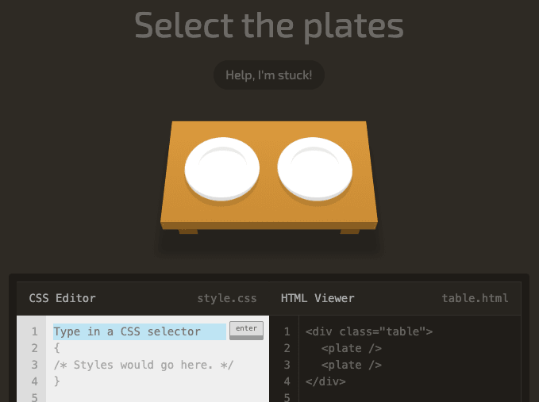

## CSS Games

I have recently been reviewing CSS concepts as I prepare for front-end interviews. Being a newbie to coding I found CSS to be a very frustrating experience. I find myself always looking up how to do CSS grids or quickly review flexbox before implenting it in a project. I am someone who does enjoy playing video games (huge FFXIV nerd over here), so I was quite delighted when I came across these games environments to learn CSS. It's so fun to see people who are good at coding have the skills to make games that help people like me be able to learn to code.

Here are some games to help level up your CSS skills:

### [Flexbox Froggy](http://flexboxfroggy.com/)

One difficult CSS concept that trips me up on a daily basis is Flexbox. This game covers the flex properties like `align-items` , `justify-content`, `align-content`, `flex-direction`, `align-self`, `flex-wrap`, `flex-flow` and order in 24 different levels. These levels get more difficult as you progress.

### [Flexbox Zombies](https://mastery.games/post/flexboxzombies2/)

In this game you use Flexbox to position the hero's crossbow and hit the zombies and survive along the game. This game is quite addicting since each section unravels part of the plot. Playing a zombie game that forces you to solidify these skills like your life depends on it.

This game was designed by Dave Geddes (he also created Gridcritters mentioned below).

### [Flexbox Defense](http://www.flexboxdefense.com/)

This game is based on a classic tower defense game. In order to place the items you need to write CSS instructions. Move the towers into effective positions using flexbox properties.

### [Grid Garden](https://cssgridgarden.com/)

Grid garden game features 28 levels starting with easy difficulty and gradually increases. You need to use CSS grid properties to water and grow your carrot garden. If you are a huge fan of games like Stardew valley (farming sims) then this is a unique and fun way to spend your free time growing a virtual garden while learning how to use grids.

### [CSS Battle](https://cssbattle.dev/)

This game is slightly different than the others mentioned. CSS Battle is more of an online challenge where the objective is to write HTML and CSS to replicate the given targter image in the least amount of code lines. You can even replay each challenge if you want to improve your score and compete against other layers to get the highest score on the leaderboard.

### [CSS Diner](https://flukeout.github.io/)

The CSS Diner webapp is one I just discovered this week as I was practicing DOM. The goal is to use CSS statements to select specific UI elements on the screen. It is educational for all developers of any skill level. There are 32 levels of increasing difficulty. The first few levels just teach you the fundamentals of CSS selectors - including element and class selectors.

### [CodeMonkey](https://www.codemonkey.com/)

This is different in that it uses CoffeeScript, a real programming language to teach you to build your own games in HTML5. More aimed at introducing coding to kids, but it is also fun for adults.

### [CodinGame](https://www.codingame.com/start)

This site offers up a lot of fun free games to help learning more than 25 programming languages, including JS, Ruby, and PHP. You can even enter international coding competitions if you want to challenge yourself and solidify your mental models of specific concepts.

### [Gridcritters Mastery](https://gridcritters.com/)

This game you have to pay to play - it is not free like the others included in this list. You need to use your CSS grid skills to save alien critters from extinction! At each level more challenging requirements must be fulfilled in order to succeed and proceed to the next stage.
